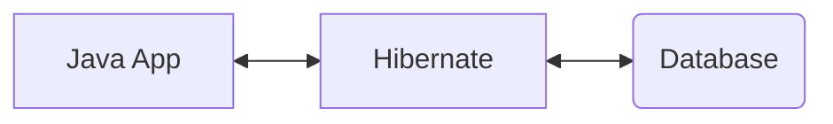
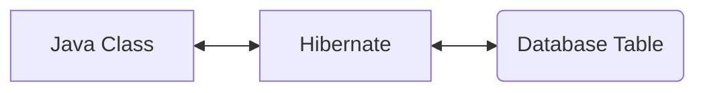

# What is Hibernate? 
* A framework for persisting/savnig Java objects into DB.
* Very popular in Enterprise applications.

At very high level:

## Benefits of using Hibernate
* It handles all of the low-level SQL Code.
* Minimizes the amount of JDBC code that the dev has to write.
* Provides the ORM (Object-to-Relational Mapping)

## How does Hibernate work?
* Developer defines mapping between Java class and DB table.

* The dev sets up the one-to-one mapping between the fields and actual columns in the DB.
* Mapping can be set via configuration file - XML or using Java Annotations.

# What is JPA?
* JPA is Jakarta Persistence API, previously known as Java Persistence API
* It is standard API for ORM
* It is only a specification that 
  * defines a set of interfaces
  * and requires an implementation to be usable

### JPA - Vendor Implementations
* Starting with JPA Spec ( list of implementations ). One such implementation is Hibernate (another is EclipseLink).
* Just like Java coding, we take the interfaces and provide implementations. 
* Hibernate is porbably the most popular implementation of JPA Standards and default implementation used in SpringBoot.

## Benefits of JPA
* By having a Standard API, dev is not locked to a Vendor's Implementation.
* Maintain portable, flexible code by coding to JPA specs.
* Theoretically, switching vendor is easy.

## Saving a Java Object using JPA
1. Create Java Object (using new keyword or builder)
2. Save it to DB (using `.persist( <myObject> )` method of entity manager. )
Entity manager is a special JPA _helper_ object.
* In the background, JPA will take the Java Object, based on the mappings defined earlier, JPA will take the object info and store it in the appropriate table's appropriate columns.
* JPA (ie. Hibernate) will do all the background work for dev.
* In older days of JDBC, dev had to manually write SQL code and execute the SQL statements.

## Retrieving a Java Object using JPA
* Create Java Object
* Retrieve Object information from DB (using `.find( <myObject>.class, primaryID )` method of entity manager. )
* Each object has a primary key. So retrieving object info from DB requires each object to have a primary key.
* Behind the scenes, JPA will search for the object with specified primary key/ID.
* Use JQuery language to Query for data from DB. 

## Relation between Hibernate/JPA and JDBC
* Hibernate/JPA actually uses JDBC for all DB Communications.
* Thus, Hibernate/JPA is just another layer of Abstraction on top of JDBC.
* So, the Hibernate/JPA does a lot of low-level work, in the background, it all goes through the standard JDBC Api.
* During our coding excercise, we'll configure Hibernate/JPA to talk to your database, and we'll actually configure it using a JDBC driver and we'll cover all the technical details.

