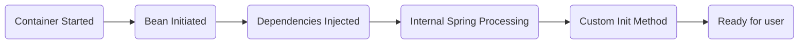
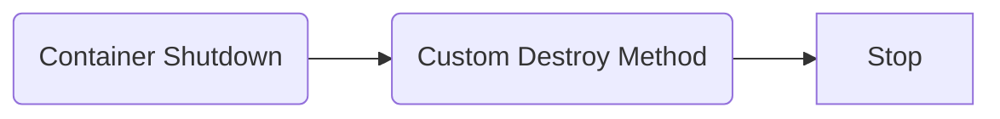

## Development Process -
1. Define the dependency interface and class
2. Create REST controller

# Dependency Injection
## A. Constructor Injection
### Development Process - 
1. Create a constructor in your class for injections
2. Add `@GetMapping` for `/{endpoint}`

### Working - behind the scenes
* Behind the scenes, spring will create a new instance of Coach Class.
* It will perform constructor injection - pass instance to DemoController.

## Component Scanning
* Spring will scan Java Classes for Special annotations - `@Component`, etc
* Automatically register the beans in the Spring Container.
* @SpringBootApplication enables Auto Configuration, Component Scanning, Additional Configuration.
  + @SpringBootApplication Annotation comprises of:

| Annotation | Description          |
| ---------- | -------------------- |
| `@EnableAutoConfiguration` | Enables SpringBoot's AutoConfiguration Support |
| `@ComponentScan` | Enables component scanning of Current Package & recursively scans sub-packages |
| `@Configuration` | Able to register extra beans with `@Bean` or import other configuration classes |

## B. Setter Injection
* Inject dependencies by calling setter methods on your class.
### Development Process - 
1. Create setter method(s) in class for injections
2. Configure the dependency injection with `@Autowired` Annotation

### Working - behind the scenes
* Spring will create the instance of CricketCoach
* Dev will create the instance of DemoController
* Using setter method, Dev passes the instance of the Coach Implementation
* The instance can be passed to any method that has `@Autowired` annotation.

## C. Field Injection
* Not recommended by the spring.io dev team
* Field injection makes it harder to Unit test the code
* Inject dependencies by setting field values on class directly, even the private fields
* Accomplished by using Java reflections

### Development Process - 
1. Configure the dependency using @Autowired annotation
2. Annotate the field with `@Autowired`

## Usage 
### Constructor Injection
  + Use this when you have required dependencies
  + Generally recommended by the spring.io development team as first choice

### Setter Injection
  + Use this when you have optional dependencies, such that if dependency is not provided, your app can provide resonable default logic.

___
# Multiple Implementations
* When there are multiple Beans implementation of same interface, that can be injected, Spring will report an error.
* Dev can specify to Spring, which implementation class to inject by using below Qualifiers:

## @Qualifier Annotation
* `@Qualifier` Annotation must be used to Specify the Object instance (Bean) required.
* `@Qualifier` Annotation can be used with both, Constructor & Setter Injection.

## @Primary  Annotation
* A class marked with `@Primary` annotation, tells Spring that, even though there may be multiple implementations, the Annotated class is Primary class to be used.
* No need to use `@Qualifier`.
* Only one class must be marked with @Primary Annotation.

* Among `@Primary` and `@Qualifier`, `@Qualifier` has higher priority.
* `@Primary` leaves it up to implementation whereas @Qualifier allows you to be very specific.

# Lazy Initialization
By default, when the application is initialized, all Beans are Initilized. Spring creates an instance of each and makes them available.
This can be traced by adding println statements in the constructors.
Instead of creating all beans upfront, we can specify Lazy Initialization, ie. Beans will be initialized when:
* needed for Dependency Injection
* Explicitly requested

Use `@Lazy` Annotation on the classes that are not required upfront.
Other way to achieve same result, without individually marking each class with @Lazy annotation, dev can use 
set in the `application.properties` file: `spring.main.lazy-initialization=true`
* __Lazy initialization is disabled by default as the configuration issues may be discovered late, until bean is created.__ 

___
# Bean Scopes
* Refers to lifecycle of Bean 
  + How long does the Bean Live?
  + How many instances are created?
  + How are Beans shared?
* ___Default scope is Singleton.___ Thus, All dependency injections refer to same Bean.

## Types of Scope
| Type        | Description                                            |
|-------------|--------------------------------------------------------|
| Singleton   | Single shared instance. _Default scope_.               |
| ProtoType   | New bean instance for each container request.          |
| Request     | Scoped to an HTTP web request. Only used for web apps. |
| Session     | Scoped to an HTTP web request. Only used for web apps. |
| Application | Scoped to a web app servlet. Only used for web apps.   |
| Websocket   | Scoped to a web socket. Only used for web apps.        |

The Bean scope can be defined by using the `@Scope` annotation on class.
Eg:
  `@Scope(ConfigurableBeanFactory.SCOPE_PROTOTYE)`

# Bean Lifecycle

---

